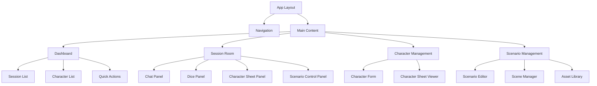
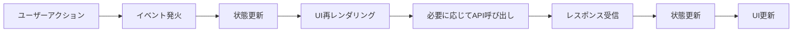
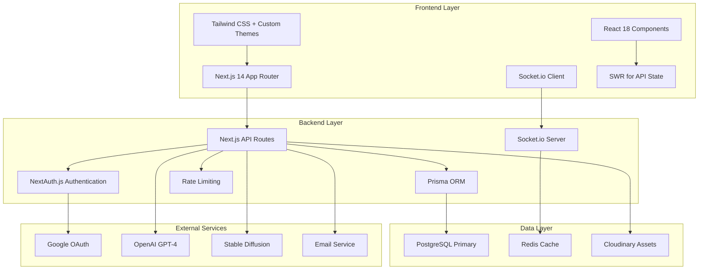
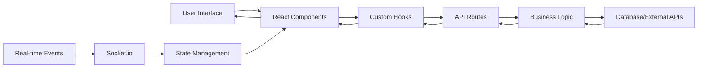

# クトゥルフ神話TRPGセッションツール 詳細設計ドキュメント

## 概要

Project Cは、クトゥルフ神話TRPGに特化したオンラインセッションツールで、従来のセッション管理機能に加えて、AI技術を活用した二次創作支援機能を提供します。React + Next.js + Tailwind CSSをベースとしたモダンなWebアプリケーションとして構築し、リアルタイム通信とAI統合を核とした設計を採用します。

### 設計の特徴
- **既存構造尊重**: 現在のNext.js + App Router + Prisma + NextAuth.jsの構成を維持しつつ拡張
- **段階的実装**: 高優先度機能から順次実装し、リスクを最小化
- **スケーラビリティ**: マイクロサービスアーキテクチャを考慮した設計
- **セキュリティ**: 多層防御による堅牢なセキュリティ設計
- **パフォーマンス**: 最適化戦略による高速なユーザー体験

### 技術スタック
- **Frontend**: Next.js 14 (App Router), React 18, TypeScript, Tailwind CSS
- **Backend**: Next.js API Routes, NextAuth.js, Prisma ORM, Socket.io
- **Database**: PostgreSQL (本番), SQLite (開発), Redis (キャッシュ・セッション)
- **AI Services**: OpenAI GPT-4, Stable Diffusion API
- **External Services**: Google OAuth, Cloudinary (メディア管理)

## 1. ディレクトリ構造設計

### 拡張後のプロジェクト構造

```
src/
├── app/                          # Next.js App Router
│   ├── (auth)/                   # 認証関連ページ
│   │   ├── signin/
│   │   └── error/
│   ├── (dashboard)/              # ダッシュボード関連ページ
│   │   ├── dashboard/
│   │   └── characters/
│   ├── (session)/                # セッション関連ページ
│   │   ├── session/
│   │   │   └── [id]/
│   │   └── logs/
│   ├── scenarios/                # シナリオ管理ページ
│   ├── api/                      # APIエンドポイント
│   │   ├── auth/
│   │   ├── characters/
│   │   ├── sessions/
│   │   ├── dice/
│   │   └── ai/
│   └── layout.tsx
├── components/                   # Reactコンポーネント
│   ├── ui/                       # 共通UIコンポーネント
│   │   ├── Button.tsx
│   │   ├── Input.tsx
│   │   └── Modal.tsx
│   ├── session/                  # セッション関連コンポーネント
│   │   ├── SessionRoom.tsx
│   │   ├── ChatInterface.tsx
│   │   └── ParticipantList.tsx
│   ├── character/                # キャラクター関連コンポーネント
│   │   ├── CharacterSheet.tsx
│   │   ├── CharacterForm.tsx
│   │   └── CharacterList.tsx
│   ├── dice/                     # ダイス関連コンポーネント
│   │   ├── DiceRoller.tsx
│   │   └── DiceHistory.tsx
│   └── ai/                       # AI関連コンポーネント
│       ├── AIDescriptionGenerator.tsx
│       └── AIRoleplayAssistant.tsx
├── lib/                          # ユーティリティ・ライブラリ
│   ├── auth/                     # 認証関連ユーティリティ
│   ├── db/                       # データベース関連ユーティリティ
│   ├── session/                  # セッション管理ユーティリティ
│   ├── dice/                     # ダイス機能ユーティリティ
│   ├── ai/                       # AI統合ユーティリティ
│   └── websocket/                # リアルタイム通信ユーティリティ
├── hooks/                        # カスタムReactフック
│   ├── useAuth.ts
│   ├── useSession.ts
│   ├── useCharacter.ts
│   └── useDice.ts
├── types/                        # TypeScript型定義
│   ├── api.ts
│   ├── character.ts
│   ├── session.ts
│   ├── dice.ts
│   └── ai.ts
├── constants/                    # 定数定義
│   ├── rules.ts
│   ├── limits.ts
│   └── messages.ts
├── utils/                        # 汎用ユーティリティ
│   ├── validation.ts
│   ├── formatting.ts
│   └── conversion.ts
└── __tests__/                    # テストファイル
    ├── components/
    ├── lib/
    ├── hooks/
    └── integration/
```

## 2. コンポーネントアーキテクチャ設計

### 設計原則
- **再利用性**: 共通コンポーネントの最大化
- **関心の分離**: UI、ビジネスロジック、データの分離
- **コンポジション**: 小さなコンポーネントの組み合わせ
- **アクセシビリティ**: 適切なARIA属性とキーボード操作
- **パフォーマンス**: メモ化と最適化

### 主要コンポーネント設計

**UI共通コンポーネント**:
- `Button`: アクションボタン（プライマリ、セカンダリ、危険）
- `Input`: フォーム入力（テキスト、数値、セレクト）
- `Modal`: ダイアログ（確認、フォーム、情報表示）
- `Form`: バリデーション付きフォーム
- `Table`: データ表示テーブル
- `Notification`: トースト通知

**機能別コンポーネント**:
- セッション関連: `SessionRoom`, `ChatInterface`, `ParticipantList`
- キャラクター関連: `CharacterSheet`, `CharacterForm`, `CharacterList`
- ダイス関連: `DiceRoller`, `DiceHistory`, `DiceResult`
- AI関連: `AIDescriptionGenerator`, `AIRoleplayAssistant`

### コンポーネント階層構造



## 3. データフローと状態管理設計

### 状態管理アーキテクチャ

**ローカル状態**:
- React useState/useReducer: コンポーネント固有の状態
- React Context: アプリケーションレベルでの状態共有

**サーバー状態**:
- SWR: API呼び出しとキャッシュ管理
- React Query: 高度なサーバー状態管理（オプション）

**リアルタイム状態**:
- Socket.io: WebSocketによるリアルタイム同期
- Zustand: グローバル状態管理（リアルタイム状態）

### 主要な状態設計

**認証状態**:
```typescript
interface AuthState {
  user: User | null;
  session: Session | null;
  isLoading: boolean;
  error: string | null;
}
```

**セッション状態**:
```typescript
interface SessionState {
  currentSession: Session | null;
  participants: User[];
  messages: ChatMessage[];
  diceHistory: DiceResult[];
  isConnected: boolean;
}
```

**キャラクター状態**:
```typescript
interface CharacterState {
  characters: CharacterSheet[];
  currentCharacter: CharacterSheet | null;
  isLoading: boolean;
}
```

**UI状態**:
```typescript
interface UIState {
  modals: Record<string, boolean>;
  notifications: Notification[];
  theme: 'light' | 'dark' | 'custom';
}
```

### データフロー



## 4. API設計とエンドポイント構造

### API設計原則
- **RESTful**: 適切なHTTPメソッドとステータスコード
- **一貫性**: 命名規則とレスポンス形式の統一
- **セキュリティ**: 認証・認可・入力バリデーション
- **パフォーマンス**: 適切なキャッシュ戦略
- **エラーハンドリング**: 統一されたエラーレスポンス

### 主要APIエンドポイント

**認証関連**:
- `GET /api/auth/session` - セッション情報取得
- `POST /api/auth/signout` - ログアウト

**ユーザー管理**:
- `GET /api/user/profile` - ユーザープロフィール取得
- `PUT /api/user/profile` - ユーザープロフィール更新
- `GET /api/user/subscription` - サブスクリプション情報取得

**キャラクター管理**:
- `GET /api/characters` - キャラクター一覧取得
- `POST /api/characters` - 新規キャラクター作成
- `GET /api/characters/[id]` - キャラクター詳細取得
- `PUT /api/characters/[id]` - キャラクター更新
- `DELETE /api/characters/[id]` - キャラクター削除

**セッション管理**:
- `GET /api/sessions` - セッション一覧取得
- `POST /api/sessions` - 新規セッション作成
- `GET /api/sessions/[id]` - セッション詳細取得
- `PUT /api/sessions/[id]` - セッション更新
- `DELETE /api/sessions/[id]` - セッション削除
- `POST /api/sessions/[id]/join` - セッション参加

**ダイス機能**:
- `POST /api/dice/roll` - ダイスロール実行
- `GET /api/dice/history` - ダイス履歴取得

**AI機能**:
- `POST /api/ai/description` - 情景描写生成
- `POST /api/ai/roleplay` - ロールプレイ提案生成
- `POST /api/ai/summary` - あらすじ生成
- `POST /api/ai/novel` - 小説生成

### APIレスポンス形式

**成功レスポンス**:
```json
{
  "success": true,
  "data": { ... },
  "message": "操作が成功しました"
}
```

**エラーレスポンス**:
```json
{
  "success": false,
  "error": {
    "code": "VALIDATION_ERROR",
    "message": "入力データが無効です",
    "details": { ... }
  }
}
```

## 5. セキュリティアーキテクチャ設計

### 多層防御アプローチ

**ネットワークセキュリティ**:
- TLS 1.3暗号化
- HTTPS強制 (middleware.ts)
- CSP (Content Security Policy)
- HSTS (HTTP Strict Transport Security)

**認証・認可**:
- NextAuth.js: Google OAuth + JWT
- RBAC (Role-Based Access Control)
- セッション管理と自動失効

**データセキュリティ**:
- 入力バリデーション (Zod)
- SQLインジェクション対策 (Prisma)
- XSS対策 (React + CSP)
- CSRF対策 (NextAuth.js)

**APIセキュリティ**:
- レートリミッティング
- APIキー管理
- リクエスト署名検証
- 適切なエラーメッセージ隠蔽

### セキュリティ実装

```typescript
// middleware.ts - セキュリティミドルウェア
import { NextResponse } from 'next/server';
import type { NextRequest } from 'next/server';

export function middleware(request: NextRequest) {
  // HTTPS強制
  if (process.env.NODE_ENV === 'production' && !request.url.startsWith('https://')) {
    return NextResponse.redirect(new URL(request.url.replace('http://', 'https://')));
  }

  // CSPヘッダー
  const response = NextResponse.next();
  response.headers.set('Content-Security-Policy', "default-src 'self'; script-src 'self' 'unsafe-inline';");

  return response;
}
```

## 6. パフォーマンス最適化戦略

### 目標パフォーマンス指標
- **ページロード時間**: 3秒以内
- **APIレスポンス時間**: 500ms以内
- **リアルタイム通信遅延**: 100ms以内
- **同時接続ユーザー数**: 100人以上

### 最適化層

**フロントエンド最適化**:
- Code Splitting: Next.js動的インポート
- Bundle Optimization: 不要コード除去
- Image Optimization: Next.js Imageコンポーネント
- Caching: SWRによるデータキャッシュ

**バックエンド最適化**:
- Database Query Optimization: Prismaクエリ最適化
- API Response Caching: Redisキャッシュ
- Connection Pooling: データベース接続プール
- Rate Limiting: APIレート制限

**リアルタイム通信最適化**:
- WebSocket Connection Pooling: 接続効率化
- Message Batching: メッセージバッチ処理
- Selective Updates: 必要なデータのみ送信

**AI統合最適化**:
- Response Caching: AI生成結果キャッシュ
- Queue Management: リクエストキューイング
- Cost Optimization: API使用量最適化

### CDNと静的アセット最適化

```typescript
// next.config.ts - CDN設定
module.exports = {
  images: {
    domains: ['res.cloudinary.com'],
    formats: ['image/webp', 'image/avif'],
  },
  experimental: {
    optimizeCss: true,
    optimizePackageImports: ['@heroicons/react'],
  },
};
```

## 7. 実装フェーズ設計

### フェーズ1: 基盤構築 (2週間)
- プロジェクト構造の整理と最適化
- 依存関係の更新と整理
- 開発環境の整備
- 基本的なテスト基盤の構築

### フェーズ2: コア機能実装 (4週間)
- キャラクターシート管理機能
- ダイス機能の実装
- リアルタイム通信基盤
- セッションログ保存機能
- 基本的なUI/UX実装

### フェーズ3: AI機能統合 (4週間)
- AI描写補助機能
- AIロールプレイ提案機能
- AIあらすじ生成機能
- AI統合の安定化と最適化

### フェーズ4: 高度機能実装 (4週間)
- シナリオ管理機能
- メディア管理機能
- スキン機能
- 有料プラン管理機能
- パフォーマンス最適化

### フェーズ5: テスト・デプロイ (2週間)
- 総合テスト実装
- E2Eテスト
- パフォーマンステスト
- 本番環境デプロイ
- モニタリング設定

## 8. テスト戦略と検証方法設計

### テスト層

**ユニットテスト**:
- ユーティリティ関数
- フック関数
- 個別コンポーネント
- APIハンドラー

**統合テスト**:
- コンポーネント間の連携
- APIとデータベースの連携
- 認証・認可フロー

**E2Eテスト**:
- ユーザーシナリオのテスト
- クリティカルパスの検証
- リアルタイム通信のテスト

### テストツール
- **Jest + React Testing Library**: ユニット・統合テスト
- **Playwright**: E2Eテスト
- **k6**: パフォーマンステスト
- **OWASP ZAP**: セキュリティテスト

### テストカバレッジ目標
- ユニットテスト: 80%以上
- 統合テスト: 主要フロー全カバー
- E2Eテスト: クリティカルユーザーストーリー全カバー

### CI/CDパイプライン
```yaml
name: CI/CD Pipeline
on: [push, pull_request]

jobs:
  test:
    runs-on: ubuntu-latest
    steps:
      - name: Run Unit Tests
        run: npm run test:unit
      - name: Run Integration Tests
        run: npm run test:integration
      - name: Run E2E Tests
        run: npm run test:e2e

  deploy:
    needs: test
    if: github.ref == 'refs/heads/main'
    runs-on: ubuntu-latest
    steps:
      - name: Deploy to Production
        run: npm run deploy
```

## 9. まとめ

### 設計のポイント
1. **既存構造の尊重**: Next.js + App Routerの構成を維持しつつ拡張
2. **段階的実装**: 高優先度機能から順次実装し、リスクを最小化
3. **スケーラビリティ**: マイクロサービスアーキテクチャを考慮した設計
4. **セキュリティ**: 多層防御による堅牢なセキュリティ設計
5. **パフォーマンス**: 最適化戦略による高速なユーザー体験

### 次のステップ
この設計ドキュメントを基に、Codeモードでの実装作業を開始します。実装作業では、各フェーズの完了ごとに設計の見直しと調整を行います。

### リスクと対策
- **技術的リスク**: 段階的実装によりリスクを最小化
- **AI依存リスク**: フォールバック機能の準備
- **リアルタイム通信複雑化**: 十分なテスト期間の確保
- **パフォーマンス劣化**: 早期最適化と定期的なパフォーマンステスト

この設計により、品質の高いクトゥルフ神話TRPGセッションツールの実現を目指します。

## システムアーキテクチャ概要

### 全体アーキテクチャ



### 技術スタック選定理由

**フロントエンド:**
- Next.js 14 (App Router): SSR/SSG対応、API Routes統合、優れたDX
- React 18: コンポーネント指向、豊富なエコシステム
- Tailwind CSS: 高速開発、一貫したデザインシステム、スキン機能対応
- Socket.io: リアルタイム通信（ダイス結果同期、チャット）
- SWR: 効率的なデータフェッチとキャッシュ

**バックエンド:**
- Next.js API Routes: フロントエンドとの統合、TypeScript共有
- NextAuth.js: Google OAuth統合、セッション管理
- Prisma: 型安全なORM、マイグレーション管理
- Socket.io Server: WebSocket管理
- Rate Limiting: API保護

**データベース:**
- PostgreSQL: ACID準拠、JSON型サポート（キャラクターシート）
- Redis: セッションキャッシュ、リアルタイム状態管理
- Cloudinary: メディアファイル最適化管理

**AI・外部サービス:**
- OpenAI GPT-4: テキスト生成（描写、小説、あらすじ）
- Stable Diffusion: 挿絵生成
- Google OAuth: セキュアな認証

## 主要インターフェース定義

### コア型定義

**キャラクターシート:**
```typescript
interface CharacterSheet {
  id: string;
  userId: string;
  name: string;
  ruleVersion: '6th' | '7th';
  stats: {
    str: number; con: number; pow: number; dex: number;
    app: number; siz: number; int: number; edu: number;
    san: number; hp: number; mp: number;
  };
  skills: Record<string, number>;
  background: {
    occupation: string;
    age: number;
    backstory: string;
  };
  isShared: boolean;
  createdAt: Date;
  updatedAt: Date;
}
```

**セッション管理:**
```typescript
interface GameSession {
  id: string;
  title: string;
  keeperId: string;
  participants: User[];
  scenario?: Scenario;
  logs: SessionLog[];
  status: 'preparing' | 'active' | 'completed';
  settings: SessionSettings;
  createdAt: Date;
  updatedAt: Date;
}
```

**AI機能:**
```typescript
interface AIService {
  generateDescription(keywords: string[]): Promise<AIResponse<string>>;
  generateRoleplayOptions(situation: string, character: CharacterSheet): Promise<AIResponse<string[]>>;
  generateSynopsis(logs: SessionLog[]): Promise<AIResponse<string>>;
  generateNovel(logs: SessionLog[], characters: CharacterSheet[]): Promise<AIResponse<{
    content: string;
    illustrations: string[];
  }>>;
}
```

### データフローアーキテクチャ



## 実装戦略

### 開発アプローチ
1. **既存機能の強化**: 現在の認証・データベース構造を活かす
2. **段階的拡張**: 高優先度機能から順次実装
3. **継続的インテグレーション**: 各フェーズで統合テストを実施
4. **品質確保**: テスト駆動開発とコードレビューの徹底

### リスク管理
- **AI依存リスク**: フォールバック機能の実装
- **リアルタイム通信複雑化**: 段階的実装と十分なテスト
- **パフォーマンス劣化**: 早期最適化と定期モニタリング
- **セキュリティリスク**: 多層防御と定期セキュリティ監査

## まとめ

この設計ドキュメントは、クトゥルフ神話TRPGセッションツールの開発指針となるものです。既存プロジェクト構造を尊重しつつ、拡張性と保守性を考慮したアーキテクチャを採用しています。

**次のステップ**: この設計に基づき、Codeモードでの実装作業を開始します。実装作業では、各フェーズの完了ごとに設計の見直しと調整を行います。