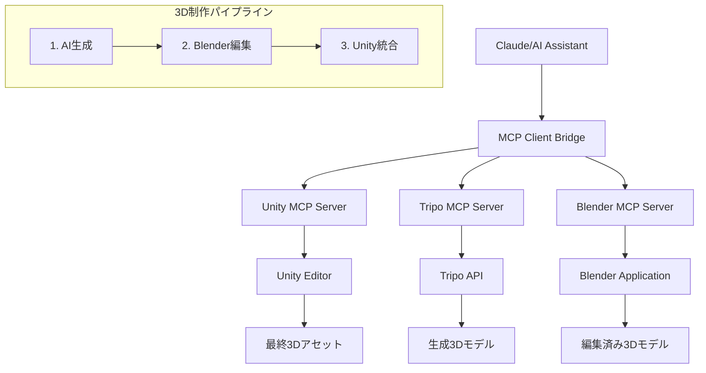
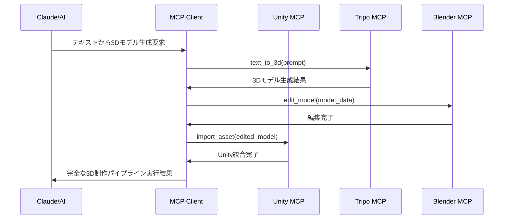
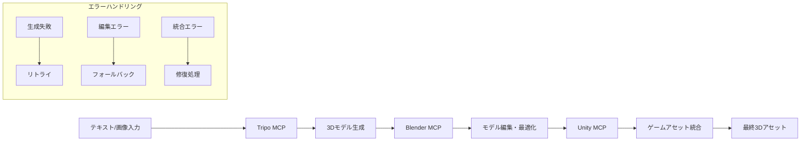

# Unity MCP統合設計書：tripo-mcp & blender-mcp統合

## 1. プロジェクト概要

### 1.1 統合目的
AI駆動の完全3D制作パイプライン構築：
- **tripo-mcp**: AI による3Dモデル生成（テキスト→3D、画像→3D）
- **blender-mcp**: Blender による高度な3Dモデリング・編集  
- **Unity MCP**: ゲームエンジンへの統合と最終調整

### 1.2 ベースアーキテクチャ
justinpbarnett版Unity MCPをベースアーキテクチャとして選定：
- 成熟度と安定性（v2.0.0）
- 包括的なツール群
- Python + C#のハイブリッド構成

## 2. 統合アーキテクチャ設計

### 2.1 システム構成図



### 2.2 通信フロー



## 3. プロジェクト構造案

### 3.1 ディレクトリ構成

```
unity-mcp-integrated/
├── README.md
├── INSTALL.md
├── config/
│   ├── mcp_servers_config.json     # 統一設定ファイル
│   ├── tripo_config.json           # Tripo固有設定
│   ├── blender_config.json         # Blender固有設定
│   └── unity_config.json           # Unity固有設定
├── servers/
│   ├── unity-mcp/                  # justinpbarnett版ベース
│   │   ├── UnityMcpBridge/        # Unity C#パッケージ
│   │   └── UnityMcpServer/        # Pythonサーバー
│   ├── tripo-mcp/                 # Node.js/TypeScript
│   │   ├── package.json
│   │   ├── src/
│   │   └── build/
│   └── blender-mcp/               # Python
│       ├── requirements.txt
│       ├── src/
│       └── blender_bridge/
├── tools/
│   ├── install.py                 # 統合インストーラー
│   ├── config_manager.py          # 設定管理ツール
│   └── workflow_coordinator.py    # ワークフロー調整
└── docs/
    ├── api/                       # API仕様書
    ├── workflows/                 # ワークフロー説明
    └── troubleshooting/           # トラブルシューティング
```

### 3.2 各MCPサーバーの配置戦略

#### 3.2.1 Unity MCP（ベース）
- **配置**: `servers/unity-mcp/`
- **役割**: 中央調整ハブ、最終統合処理
- **変更**: 最小限（安定性維持）

#### 3.2.2 Tripo MCP
- **配置**: `servers/tripo-mcp/`
- **接続方式**: 独立プロセス、TCP/IPC通信
- **設定**: TRIPO_API_KEY環境変数管理

#### 3.2.3 Blender MCP
- **配置**: `servers/blender-mcp/`
- **接続方式**: Blenderサブプロセス制御
- **要件**: ローカルBlenderインストール必須

## 4. 統一設定管理システム

### 4.1 マスター設定ファイル (`config/mcp_servers_config.json`)

```json
{
  "version": "1.0.0",
  "servers": {
    "unity-mcp": {
      "enabled": true,
      "type": "python",
      "command": "uv",
      "args": ["run", "--directory", "./servers/unity-mcp/UnityMcpServer/src", "server.py"],
      "port": 27182,
      "autostart": true
    },
    "tripo-mcp": {
      "enabled": true,
      "type": "nodejs", 
      "command": "node",
      "args": ["./servers/tripo-mcp/build/index.js"],
      "port": 27183,
      "env": {
        "TRIPO_API_KEY": "${TRIPO_API_KEY}"
      }
    },
    "blender-mcp": {
      "enabled": true,
      "type": "python",
      "command": "python",
      "args": ["./servers/blender-mcp/src/server.py"],
      "port": 27184,
      "requirements": {
        "blender_path": "${BLENDER_PATH}"
      }
    }
  },
  "workflows": {
    "ai_to_unity_pipeline": {
      "steps": ["tripo-mcp", "blender-mcp", "unity-mcp"],
      "timeout": 300,
      "retry_count": 3
    }
  }
}
```

### 4.2 設定管理ツール

```python
# tools/config_manager.py
class MCPConfigManager:
    def __init__(self, config_path="config/mcp_servers_config.json"):
        self.config_path = config_path
        
    def validate_config(self):
        """設定ファイルの妥当性検証"""
        pass
        
    def update_server_config(self, server_name, config):
        """個別サーバー設定更新"""
        pass
        
    def setup_environment(self):
        """環境変数とパス設定"""
        pass
```

## 5. ワークフロー連携パイプライン

### 5.1 3D制作パイプライン



### 5.2 ワークフロー調整器

```python
# tools/workflow_coordinator.py
class WorkflowCoordinator:
    def __init__(self, config_manager):
        self.config = config_manager
        self.servers = {}
        
    async def execute_pipeline(self, workflow_name, input_data):
        """パイプライン実行"""
        workflow = self.config.get_workflow(workflow_name)
        result = input_data
        
        for step in workflow['steps']:
            try:
                result = await self.execute_step(step, result)
            except Exception as e:
                await self.handle_error(step, e, result)
                
        return result
        
    async def execute_step(self, server_name, data):
        """個別ステップ実行"""
        server = self.servers[server_name]
        return await server.process(data)
```

## 6. インストール・セットアップ手順

### 6.1 システム要件

- **Python**: 3.12+（Unity MCP、Blender MCP）
- **Node.js**: 18.0+（Tripo MCP）
- **Unity**: 2020.3 LTS+
- **Blender**: 3.0+（ローカルインストール必須）
- **uv**: Python パッケージマネージャー

### 6.2 インストール手順

```bash
# 1. リポジトリクローン
git clone <integrated-unity-mcp-repo>
cd unity-mcp-integrated

# 2. 統合インストーラー実行
python tools/install.py

# 3. 環境変数設定
export TRIPO_API_KEY="your_api_key"
export BLENDER_PATH="/path/to/blender"

# 4. 設定検証
python tools/config_manager.py --validate

# 5. サーバー起動テスト
python tools/config_manager.py --test-all
```

### 6.3 Claude Desktop設定

```json
{
  "mcpServers": {
    "Unity-MCP-Integrated": {
      "command": "python",
      "args": [
        "./unity-mcp-integrated/tools/workflow_coordinator.py"
      ],
      "env": {
        "TRIPO_API_KEY": "your_api_key",
        "BLENDER_PATH": "/path/to/blender"
      }
    }
  }
}
```

## 7. セキュリティとパフォーマンス考慮事項

### 7.1 セキュリティ

- **API キー管理**: 環境変数による安全な管理
- **プロセス分離**: 各MCPサーバーの独立実行
- **権限制御**: 最小権限の原則適用
- **ネットワークセキュリティ**: ローカル通信の暗号化

### 7.2 パフォーマンス

- **非同期処理**: 大容量3Dファイル処理の最適化
- **キャッシュ機構**: 中間結果の効率的保存
- **リソース管理**: メモリとCPU使用量の監視
- **並列処理**: 複数ステップの同時実行

### 7.3 エラーハンドリング

```python
class PipelineError(Exception):
    """パイプライン実行エラー"""
    pass

class ErrorHandler:
    def __init__(self):
        self.retry_strategies = {
            'tripo-mcp': self.tripo_retry,
            'blender-mcp': self.blender_retry,
            'unity-mcp': self.unity_retry
        }
    
    async def handle_step_error(self, step_name, error, context):
        """ステップ別エラー処理"""
        strategy = self.retry_strategies.get(step_name)
        if strategy:
            return await strategy(error, context)
        else:
            raise PipelineError(f"Unhandled error in {step_name}: {error}")
```

## 8. 拡張性とカスタマイズ

### 8.1 プラグインアーキテクチャ

```python
class MCPPlugin:
    """MCP プラグインベースクラス"""
    def __init__(self, name, version):
        self.name = name
        self.version = version
    
    async def initialize(self, config):
        """プラグイン初期化"""
        pass
    
    async def process(self, data):
        """データ処理"""
        pass
    
    async def cleanup(self):
        """リソース解放"""
        pass
```

### 8.2 カスタムワークフロー

ユーザー定義ワークフロー対応：
- YAML設定ファイル対応
- 条件分岐処理
- カスタムステップ定義
- 外部ツール統合

## 9. 監視とログ

### 9.1 ログシステム

```python
import logging
from datetime import datetime

class MCPLogger:
    def __init__(self, name):
        self.logger = logging.getLogger(name)
        self.setup_logging()
    
    def setup_logging(self):
        handler = logging.FileHandler(f'logs/{datetime.now().strftime("%Y%m%d")}_mcp.log')
        formatter = logging.Formatter(
            '%(asctime)s - %(name)s - %(levelname)s - %(message)s'
        )
        handler.setFormatter(formatter)
        self.logger.addHandler(handler)
        self.logger.setLevel(logging.INFO)
```

### 9.2 メトリクス収集

- 処理時間測定
- リソース使用量監視  
- エラー率追跡
- ユーザー操作ログ

## 10. 今後の拡張計画

### 10.1 短期目標

- [ ] 基本統合機能の実装
- [ ] パフォーマンスチューニング
- [ ] ドキュメント整備
- [ ] ユニットテスト作成

### 10.2 中期目標

- [ ] UI管理ツール開発
- [ ] クラウド連携機能
- [ ] 他の3DツールMCP統合
- [ ] バッチ処理モード

### 10.3 長期目標

- [ ] AI学習による最適化
- [ ] リアルタイム協調機能
- [ ] VR/AR統合
- [ ] マーケットプレイス連携

---

## 結論

この統合設計により、tripo-mcp、blender-mcp、Unity MCPの3つのMCPサーバーを統合し、AI駆動の完全な3D制作パイプラインを構築できます。justinpbarnett版Unity MCPをベースとすることで安定性を確保しつつ、モジュラー設計により各サーバーの独立性と拡張性を維持します。

統一された設定管理とワークフロー調整により、シームレスな3D制作体験を提供し、AIアシスタントによる高度な3D制作自動化を実現します。